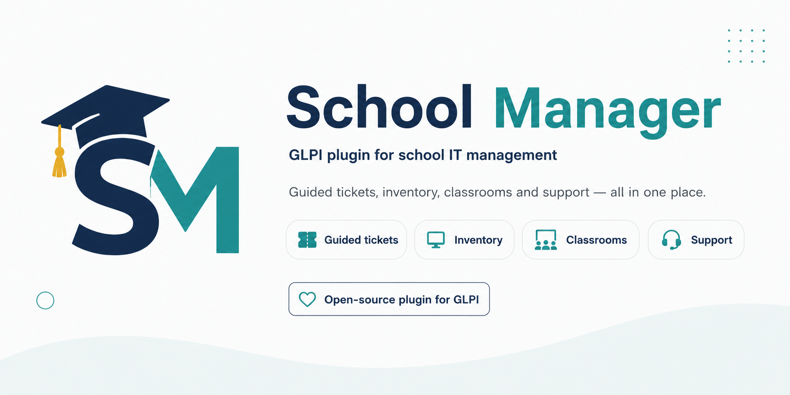
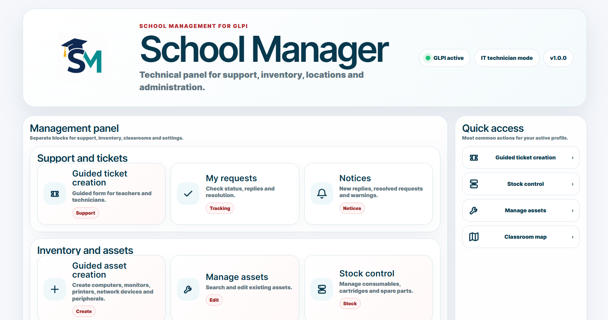
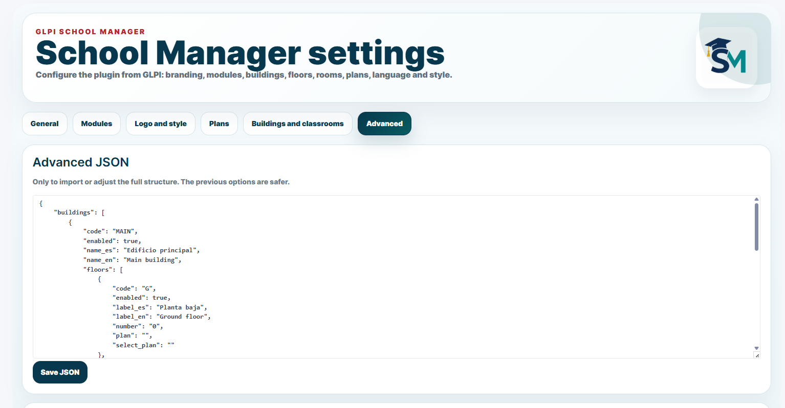
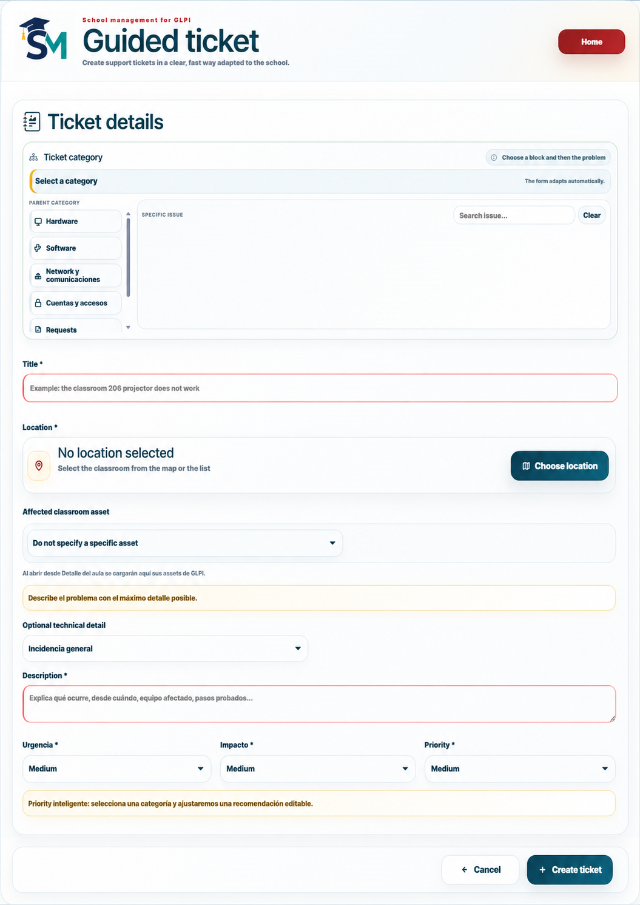
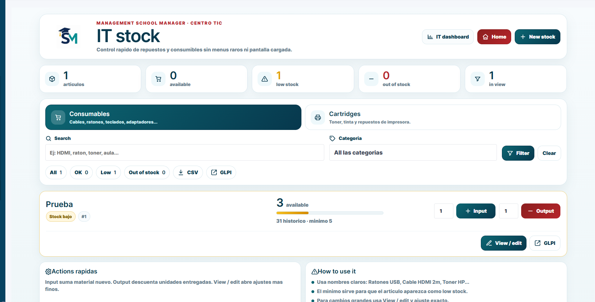
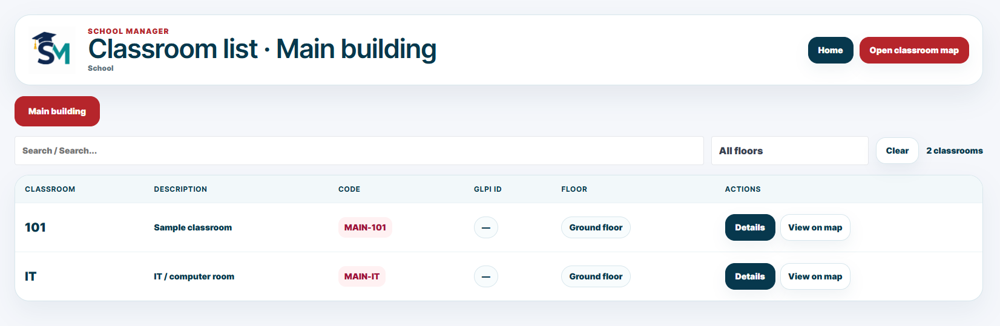
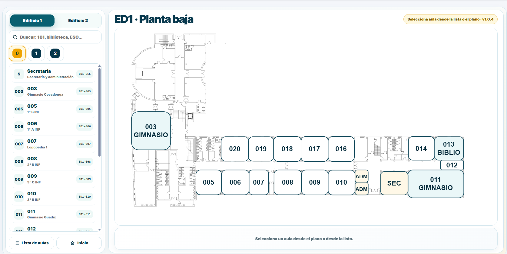

<p align="center">
  
</p>

<h1 align="center">School Manager para GLPI</h1>

<p align="center">
  Plugin de GLPI orientado a centros educativos para incidencias guiadas, stock TIC, planos, activos y trabajo técnico.
</p>

<p align="center">
  <a href="README.md">English</a> ·
  <a href="#descripcion">Descripción</a> ·
  <a href="#requisitos">Requisitos</a> ·
  <a href="#instalacion">Instalación</a> ·
  <a href="#capturas">Capturas</a> ·
  <a href="#documentacion">Documentación</a> ·
  <a href="CREDITS.md">Créditos</a>
</p>

<p align="center">
  
  
  
  
</p>

<p align="center">
  <a href="https://github.com/pabloburgos/glpi-schoolmanager-plugin/actions/workflows/ci.yml">
    
  </a>
</p>

> School Manager es un plugin no oficial de GLPI. No está mantenido por el proyecto oficial de GLPI.

<a id="descripcion"></a>

## Descripción

School Manager añade una capa de gestión más clara sobre GLPI para colegios e institutos. GLPI sigue siendo la plataforma base de ITSM e inventario, pero el plugin ofrece páginas más sencillas para profesorado, técnicos TIC y administradores del centro.

## Funciones principales

| Área | Descripción |
|---|---|
| Incidencias guiadas | Creación simplificada de tickets con categoría, aula, prioridad y activo afectado. |
| Panel TIC | Espacio de trabajo técnico para incidencias abiertas, asignación, seguimiento y resolución. |
| Control de stock | Consumibles, cartuchos, movimientos, avisos de stock bajo y uso vinculado a tickets. |
| Aulas y planos | Edificios, plantas, aulas, recursos de mapas y enlaces directos a ubicaciones GLPI. |
| Gestión de activos | Vistas simplificadas para ordenadores, monitores, impresoras, periféricos y red. |
| Configuración | Marca, logo, módulos, idioma, edificios, aulas y planos desde GLPI. |

<a id="requisitos"></a>

## Requisitos

| Componente | Soportado / recomendado |
|---|---|
| GLPI | 10.x u 11.x |
| PHP | 8.x |
| Servidor web | Apache recomendado |
| Base de datos | La misma pila de base de datos usada por GLPI |
| Sistema operativo | Servidor Linux recomendado |
| Navegador | Chrome, Edge, Firefox o Safari actual |
| Permisos | Acceso administrador de GLPI para instalación y configuración |

La carpeta del plugin debe llamarse exactamente:

```text
schoolmanager
```

Ruta final:

```text
/var/www/glpi/plugins/schoolmanager
```

<a id="instalacion"></a>

## Instalación y actualización

Ejecuta este comando en el servidor GLPI:

```bash
sudo bash -c "$(curl -fsSL https://raw.githubusercontent.com/pabloburgos/glpi-schoolmanager-plugin/main/scripts/install-or-update.sh)"
```

Después limpia caché y reinicia Apache:

```bash
cd /var/www/glpi
sudo -u www-data php bin/console cache:clear
sudo systemctl restart apache2
```

Recarga el navegador con `Ctrl + F5`.

## Estructura del repositorio

```text
glpi-schoolmanager-plugin/
├── schoolmanager/          # Carpeta real del plugin GLPI
├── public_maps/            # Recursos públicos opcionales para mapas
├── docs/                   # Documentación, banner y capturas
├── scripts/                # Scripts de instalación y actualización
├── .github/                # Workflows y plantillas de GitHub
├── README.md               # README principal en inglés
├── README_ES.md            # README en español
├── AUTHORS.md              # Autores
├── CREDITS.md              # Créditos y agradecimientos
├── CHANGELOG.md            # Historial de cambios
├── SECURITY.md             # Política de seguridad
└── LICENSE                 # GPL-3.0-or-later
```

<a id="capturas"></a>

## Capturas

### Panel principal

Página principal del plugin.



### Configuración

Ajustes del plugin, marca y módulos.



### Incidencias guiadas

Flujo de creación de tickets para profesorado y personal.



### Control de stock

Consumibles, movimientos y acciones de inventario.



### Aulas

Listado de aulas, ubicaciones GLPI y acciones rápidas.



### Planos

Navegación por planos y ubicaciones.



<a id="documentacion"></a>

## Documentación

| Documento | Descripción |
|---|---|
| [docs/INSTALLATION.md](docs/INSTALLATION.md) | Guía de instalación y actualización. |
| [docs/CONFIGURATION.md](docs/CONFIGURATION.md) | Guía de configuración del plugin. |
| [docs/COMPATIBILITY.md](docs/COMPATIBILITY.md) | Notas de compatibilidad. |
| [docs/PAGES.md](docs/PAGES.md) | Páginas PHP principales. |
| [docs/STRUCTURE.md](docs/STRUCTURE.md) | Estructura del repositorio. |
| [docs/LEGAL.md](docs/LEGAL.md) | Notas legales y de licencia. |
| [docs/GITHUB_SETUP.md](docs/GITHUB_SETUP.md) | Notas de configuración en GitHub. |
| [RELEASE_CHECKLIST.md](RELEASE_CHECKLIST.md) | Checklist de release. |
| [CONTRIBUTING.md](CONTRIBUTING.md) | Guía de contribución. |
| [SECURITY.md](SECURITY.md) | Política de seguridad. |
| [SUPPORT.md](SUPPORT.md) | Guía de soporte. |
| [CREDITS.md](CREDITS.md) | Créditos y agradecimientos. |
| [CHANGELOG.md](CHANGELOG.md) | Historial de cambios. |

## Licencia

School Manager se distribuye bajo GNU General Public License v3.0 or later.

SPDX-License-Identifier: `GPL-3.0-or-later`

Consulta [LICENSE](LICENSE).
